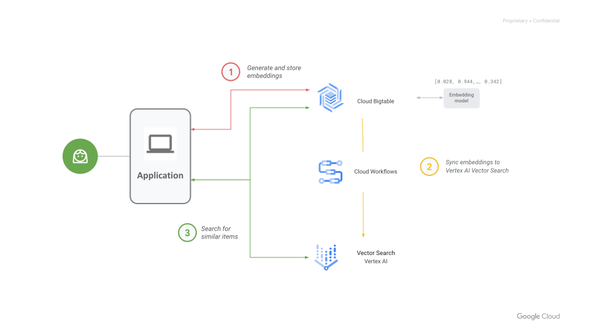

# Cloud Bigtable to Vertex Vector Search Export README

[Cloud Bigtable](https://cloud.google.com/bigtable) is a fully managed,
mission-critical, relational database service that offers transactional
consistency at global scale. [Vertex AI Vector
Search](https://cloud.google.com/vertex-ai/docs/vector-search/overview)
allows users to search for semantically similar items using vector embeddings.

You can integrate your Cloud Bigtable database with Vector Search to perform
vector similarity search on your Bigtable data. The general workflow is as follows:

1.  Generate and store vector embeddings in Bigtable. You can manage
    them similarly to your operational data.
2.  Export and upload embeddings into a Vector Search index using the
    [workflow](#set-up-cloud-workflow) presented on this page.
3.  Query the Vector Search index for similar items. You can query using
    a [public
    endpoint](https://cloud.google.com/vertex-ai/docs/vector-search/query-index-public-endpoint)
    or through [VPC
    peering](https://cloud.google.com/vertex-ai/docs/vector-search/query-index-vpc).

## Overview

Exporting embeddings from Cloud Bigtable to Vertex AI Vector Search is achieved
by using the Cloud Workflow provided in this repository. For instructions on how
to get started immediately, see [Before you begin](#before-you-begin).



**Figure**: Export and sync Bigtable data into Vector Search workflow.

This tutorial uses billable components of Google Cloud, including:

1.  **Cloud Bigtable**: Store embeddings and operational data in Bigtable.
2.  **Vertex AI**: Generate embeddings using models served by Vertex AI.
3.  **Cloud Dataflow**: Use a dataflow template to export the embeddings from
    Bigtable to Cloud Storage.
4.  **Google Cloud Storage (GCS)**: Store exported embeddings from Bigtable in a GCS
    bucket in the input JSON format expected by Vector Search.
5.  **Cloud Workflow**: Orchestrate these two steps for the end-to-end flow..
    1.  Export embeddings from Bigtable to GCS as JSON.
    2.  Build the Vector Search index from the JSON files in GCS.
6.  **Cloud Scheduler**: Used to trigger the Cloud Workflow.

## Before you begin

1.  Ensure that your account has the required [permissions](#permissions).
2.  Generate and store embeddings in your Bigtable database as `ARRAY<float64>`.
    For more details see [Bigtable schema](#bigtable-schema).

## Set up Cloud Workflow

To set up a periodic batch export from Bigtable to a Vertex AI Vector Search
index:

### 1.  Create an empty index:

   Follow the instructions on the
    [Create an index](https://cloud.google.com/vertex-ai/docs/vector-search/create-manage-index#create-index)
    page. In the folder that is passed to `contentsDeltaUri`, create an empty
    file called `empty.json`. This creates an empty index.
    If you already have an index, you can skip this step. The workflow will
    overwrite your index.

### 2.  Clone this git repository:
   There are multiple ways to clone a git repository, one way is to run the
    following command using the [GitHub CLI](https://github.com/cli/cli):

```
gh repo clone GoogleCloudPlatform/cloud-bigtable-examples
cd GoogleCloudPlatform/cloud-bigtable-examples/bigtable-ai/vertex-vector-search/workflows
```

   This folder contains two files:

*   `batch-export.yaml`: This is the workflow definition.
*   `sample-batch-input.json`: This is a sample of the workflow input parameters.

### 3.  Setup input.json from the sample file:

First, copy the sample JSON.

```
cp sample-batch-input.json input.json
```

Then edit `input.json` with details for your project. See the [Parameters in the
input.json file](#parameters-in-the-inputjson-file) section for more information.

### 4.  Deploy the workflow:

Deploy the workflow yaml file to your Google Cloud project. You can configure
the region or location where the workflow will run when executed.

```
  gcloud workflows deploy vector-export-workflow \
--source=batch-export.yaml [--location=<cloud region>] [--service account=<service_account>]
```

The workflow is now visible on the [Workflows
page](https://console.cloud.google.com/workflows) in the Google Cloud console.

**Note**: You can also create and deploy the workflow from the Google Cloud
console. Follow the prompts in the Cloud console. For the workflow definition,
copy and paste the contents of `batch-export.yaml`.

### 5.  **Execute the workflow**:

   Run the following command to execute the workflow:

```
gcloud workflows execute \
    vector-export-workflow --data="$(cat input.json)" \
    [--location=<cloud region>]
```

The execution shows up in the `Executions` tab in Workflows where you can
monitor it. For more information, see [Monitor Workflows and Dataflow
jobs](#monitor-workflows-and-dataflow-jobs).


**Note**: You can also execute from the console using the `Execute` button.
Follow the prompts and for the input, copy and paste the contents of your
customized `input.json`.

### 6.  **Schedule the workflow for periodic execution**:

Once the workflow executes successfully, schedule it periodically using Cloud
Scheduler. This prevents your index from becoming stale as your embeddings
change.

```
gcloud scheduler jobs create http vector-export-workflow \
  --message-body="{ argument : $(cat input.json) }" \
  --schedule="0 * * * *" --time-zone="PDT" \
  --uri <invocation_url> [--service account=<service_account>]
```

The schedule argument accepts
[unix-cron](https://cloud.google.com/scheduler/docs/configuring/cron-job-schedules)
format. The time-zone argument must be from the
[tz database](https://en.wikipedia.org/wiki/List_of_tz_database_time_zones). See
[scheduler help](https://cloud.google.com/sdk/gcloud/reference/scheduler/jobs/create/http)
for more information. The `invocation_url` can be determined from the workflow
details page in the console by clicking on the `Details` tab.

## Appendix
### Permissions

For production environments, we strongly recommend creating a new service
account and granting it one or more IAM roles that contain the minimum
permissions required for managing service. You can also choose to use
different service accounts for different services as described below.

The following roles are needed to complete the instructions on this page.

1.  [Cloud Scheduler Service Account](https://cloud.google.com/run/docs/triggering/using-scheduler#command-line):
    1.  By default uses the **_Compute Engine default service account_**.
    2.  If you use a manually configured service account, you must include the
        following roles:
        1.  Cloud Scheduler Service Agent role.
        2.  To trigger the workflow: **_Workflows Invoker_**.
2.  [Cloud Workflow Service Account](https://cloud.google.com/workflows/docs/authentication#sa-permissions):
    1.  By default uses the **_Compute Engine default service account_**.
    2.  If you use a manually configured service account, you must include the
        following roles:
        1.  To trigger dataflow job: **_Dataflow Admin_**, **_Dataflow Worker_**.
        2.  To impersonate dataflow worker service account: **_Service Account User_**.
        3.  To write Logs: : **_Logs Writer_**.
        4.  To trigger Vertex AI Vector Search rebuild: **_Vertex AI User_**.
3.  [Dataflow Worker Service Account](https://cloud.google.com/dataflow/docs/concepts/security-and-permissions#worker-service-account):
    1.  By default uses the **_Compute Engine default service account_**.
    2.  If you use a manually configured service account, you must include the
        following roles:
        1.  To manage dataflow: **_Dataflow Admin_**, **_Dataflow Worker_**.
        2.  To read data from Bigtable: **_Bigtable Reader_**.
        3.  To write over selected GCS Container Registry: **_GCS Storage Bucket Owner_**.

### Parameters in the input.json file

Input to the workflow is provided using a JSON file. The included
<code>[sample-batch-input.json](https://github.com/GoogleCloudPlatform/cloud-bigtable-examples/bigtable-ai/blob/main/vertex-vector-search/workflows/sample-batch-input.json)</code>
contains both required and optional parameters. The value for each field in the
sample contains the description of the parameter. Copy the
<code>[sample-batch-input.json](https://github.com/GoogleCloudPlatform/cloud-bigtable-examples/bigtable-ai/blob/main/vertex-vector-search/workflows/sample-batch-input.json)</code>
and customize it according to the descriptions in the file. Delete the optional
parameters that you don’t want to pass.

#### Required Parameters

The required parameters are organized by product. There are 4 sections -
`dataflow`, `gcs`, `bigtable` and `vertex` - for each component that needs to be
configured. Outside of these sections, we have `location` and `project_id`.
These apply to all sections. The `location` and `project_id` arguments can be
overridden in any section if you need to run in a different location or use
resources from different projects.

##### Bigtable Parameters

Enter the `instance_id` and `table_name`. 
The following parameters: `id_column`, `embedding_column`, `crowding_tag_column`
help map which column in Bigtable (cf:col or `_key` for rowkey) to map into id, embedding and crowding_tag respecively.
`id_column` and `embedding_column` are mandatory.
In addition, `allow_restricts_mappings`, `deny_restricts_mappings`, `int_numeric_restricts_mappings`, `float_numeric_restricts_mappings` and `double_numeric_restricts_mappings` are mapping which columns to map to allow, deny, numeric int, float and double restricts respectively.
The format of the `.*_restricts_mappings` parameter is a comma separated list of
fields in the following form:

`<bigtable_column_family>:<bigtable_column_name>-><vertex_field_name>`

For example, if the Bigtable table contains the column family `cf` and in it columns called `color` and `shape` that you wish to add to allow restricts, the `allow_restricts_mappings`
parameter needs to contain the following columns and aliases:

`cf:color->color,cf:shape->shape`

##### Dataflow Parameters

`temp_location`:Google Cloud Storage location to store temporary files
generated by the dataflow job.

```
gs://<bucket_name>/<folder_name>/
```

##### GCS Parameters

`output_folder`: Google Cloud Storage location to store the JSON files generated
by the Dataflow job. To conserve storage space in Google Cloud Storage (GCS), it
is recommended that users configure a two-week TTL (time-to-live) rule for the
parent folder of any subfolders created by workflow runs. This will ensure that
any exported generated embeddings in those subfolders are automatically deleted
after two weeks. For more information on how to configure the TTL for an object,
see [Object Lifecycle
Management](https://cloud.google.com/storage/docs/lifecycle).

```
gs://<bucket_name>/<folder_name>/
```

##### Vertex Parameters

`vector_search_index_id`: Vertex AI Vector Search Index which needs to be
updated.

#### Optional Parameters

The following parameters are optional to the workflow.

##### Bigtable Parameters

*   `project_id`: GCP Project ID which contains a table with vector embeddings.
    By default, it is derived from the project_id specified at the root level of
    the JSON in the required parameters.

##### Dataflow Parameters

*   `service_account_email`: The Dataflow Worker Service Account email. By
    default, use the [Compute Engine default service
    account](https://cloud.google.com/compute/docs/access/service-accounts#default_service_account)
    of your project as the worker service account. The Compute Engine default
    service account has broad access to the resources of your project, which
    makes it easy to get started with Dataflow. However, for production
    workloads, we recommend that you create a new service account with all the
    roles listed in the [Permissions] section.
*   `project_id`: GCP Project ID on which the job runs. By default, it is
    derived from the project_id specified at the root level of the JSON in the
    required parameters.
*   `location`: Project Region from where the job runs. By default, it is derived
    from the location specified at the root level of the JSON in the required
    parameters.
*   `max_workers`: The maximum number of workers to run the job. The default is
    set to 1000.
*   `num_workers`: The initial numbers of workers to start the job. If
    auto-scaling is enabled, this is not required.
    generally not required with auto-scaling is enabled.
*   `job_name_prefix`: Dataflow Job Name Prefix. The default value is
    bigtable-vectors-export. This prefix can be used to filter jobs in the
    Dataflow console.

##### GCS Parameters

`output_file_prefix`: Exported JSON File Name Prefix. The default value is
vector-embeddings.

##### Vertex Parameters

*   `project_id`: GCP Project on which Vertex AI Vector Search index is built
    and deployed. By default, it is derived from the project_id specified at the
    root level of the JSON in the required parameters.
*   `location`: Project Region on which Vertex AI Vector Search index is built
    and deployed. By default, it is derived from the location specified at the
    root level of the JSON in the required parameters.

### Bigtable schema
Vertex AI Vector Search accepts the following
[arguments](https://cloud.google.com/vertex-ai/docs/vector-search/setup/format-structure#json) when creating or
updating the index.

* `id` (required): A string.
* `embedding` (required): An array of floats.
* `restricts` (optional): An array of objects, with each object being a nested
  structure that provides the namespace and the allow/denylist for the
  datapoint.
* `crowding_tag` (optional): A string.

When defining your Bigtable schema, you must have columns that will contain the
data for the required arguments. You
need to alias in the Cloud Workflow parameters as described
in [Bigtable Parameters](#bigtable-parameters).

The data type for each of the columns in the Bigtable schema should be as shown
below.

* `id`: Any data type that can be converted to a string.
* `embedding`: ARRAY<FLOAT64>.
* `restricts`: JSON.
* `crowding_tag`: String.

**Note**: The table may contain columns that are not relevant for the export and
sync workflow. The columns not specified in the `id_column`, `embedding_column`,
`crowding_tag_column` and the various `.*_restricts_mappings` parameters
are ignored.


### Monitor Workflows and Dataflow jobs

After you have deployed a Workflow, you can check the status of your workflow
execution in the Execution tab of the Workflows page in the Cloud console. On
the Execution details page, you can view the results of the execution including
any output, the execution ID and state, and the current or final step of the
workflow execution. Useful information is also printed to the log at the bottom
of the page. If there are errors, they are shown in the log and Output
section. For more information on debugging errors, see [Debug
Workflows](https://cloud.google.com/workflows/docs/debug).

After the workflow starts the Dataflow job, you can check the status of your job
execution from the [Jobs
dashboard](https://console.cloud.google.com/dataflow/jobs) in the Cloud console.
Find the relevant job by filtering for the `job_name_prefix` parameter that you
set in `input.json`. For troubleshooting tips, see [Pipeline troubleshooting and
debugging](https://cloud.google.com/dataflow/docs/guides/troubleshooting-your-pipeline).

After the export completes, the workflow triggers the update of the Vector
Search index. This is a long running operation and regular updates are logged in
the Workflows Execution page until completion.

